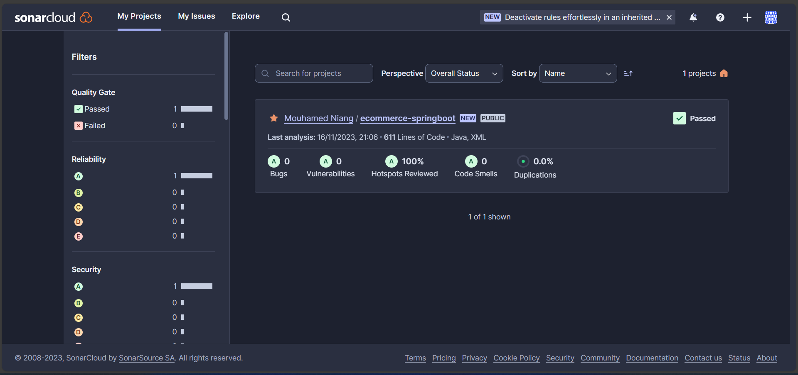

# ecommerce-springboot
this is a spring boot ecommerce base on spring boot 3 implementing spring security 6
# E-Commerce spring boot 3.1.5 API REST
Lancer le project avec l'url 
    
        http://localhost:8080/api/products
        http://localhost:8080/api/categories
    
    
## SonarCloud 
### 1. Tableau de bord 

