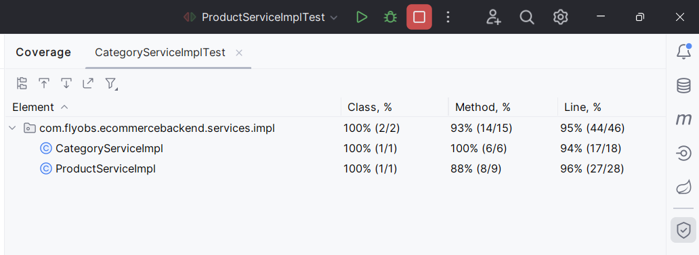
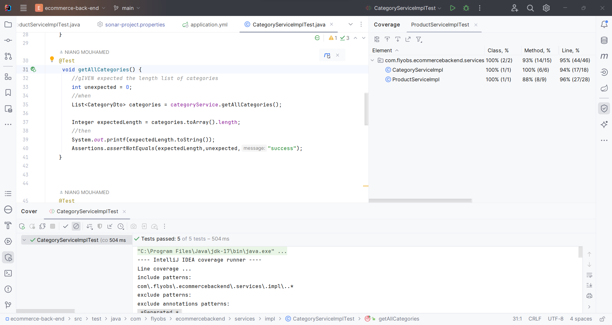
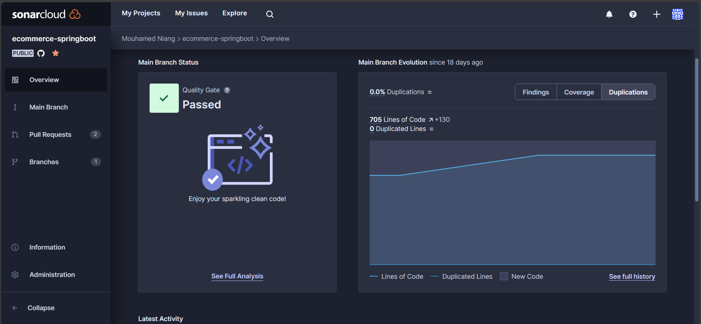

# E-Commerce spring boot 3.1.5 API REST

Lancer le project avec l'url 
    
        http://localhost:8080/api/products
        http://localhost:8080/api/categories
## Coverage Tests Unitaires

## Analyse du code avec sonarlint 

## SonarCloud 
### 1. Tableau de bord 

